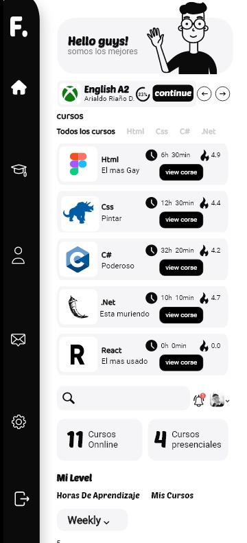
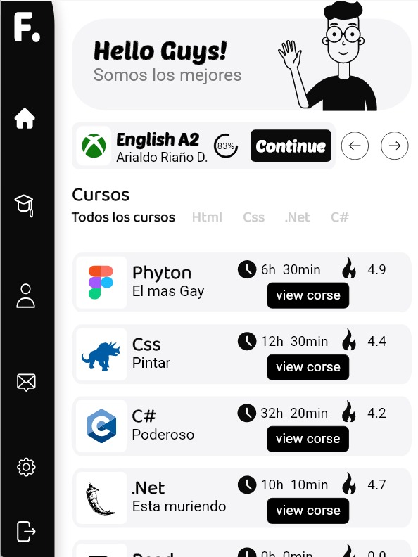
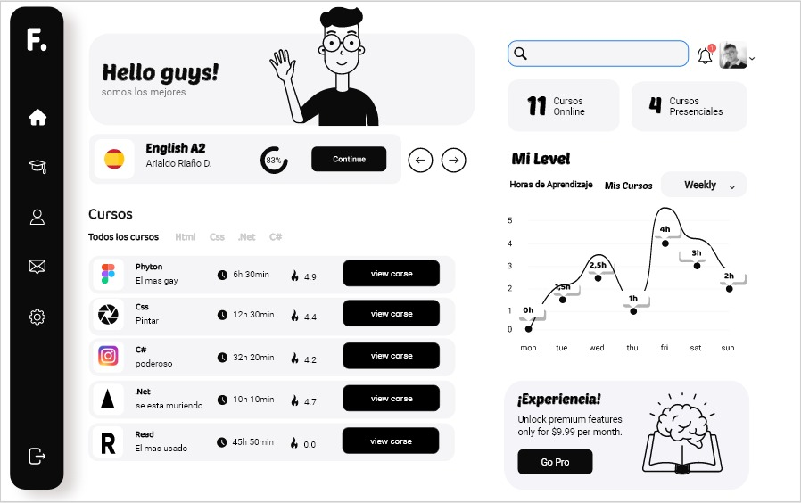
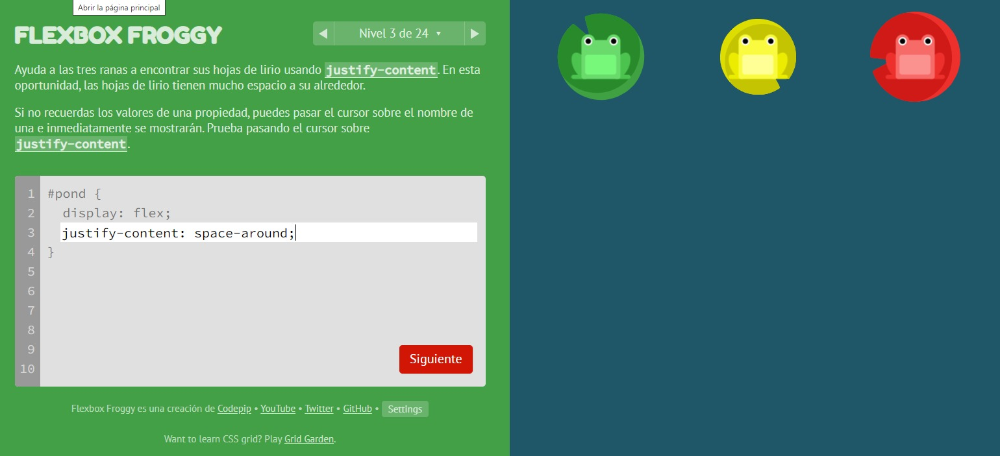

## Lo Aprendido

Diseño del cual me guie <a href="https://co.pinterest.com/pin/618189486381336452/" target="_blank"> *Diseño flex-blox*</a> .

Primero hice el diseño en Adobe XD, hice el diseño de teléfono, tablet y portátil para poder iniciar a pasar el diseño en código.

Proyecto flexbox, inicié aprendiendo flexbox con un juego de ranitas <a href="https://flexboxfroggy.com/#es" target="_blank"> *FLEXBOX FROGGY*</a>. Después aprendí sobre los *contenedores en HTML* y, gracias a mi hermano mayor, pude abrir mi mente sobre los contenedores y comencé a aprender sobre las convenciones de los nombres en *CSS3*. Utilicé la convención *"BEM"*, cuyas siglas son "Block, Element, Modifier" <a href="https://www.freecodecamp.org/news/css-naming-conventions-that-will-save-you-hours-of-debugging-35cea737d849/" target="_blank">BEM</a>. Gracias a esa convención, pude mantener mi código limpio y legible.

Comencé a aprender sobre GitHub y me familiaricé con los *comandos de Git*, aprendiendo a enviar commits desde la consola y desde "Visual Studio Code". Para nombrar los commits, me guié por la página <a href="https://www.conventionalcommits.org/es/v1.0.0/" target="_blank">*Convencional Commits*</a> y utilicé una guía de mensajes con emojis para enviar mis commits y hacerlos más legibles <a href="https://gitmoji.dev/" target="_blank">*Gitmoji*</a>.

También aprendí sobre cómo *clonar partes de código con la tecnología JavaScript*, lo cual me ahorró mucho tiempo y logré que mi código HTML y CSS3 no fuera tan extenso.

---

## Lenguajes

mas informacion, contáctame por email: arialdodiaz8@gmail.com

<table>
<tr>
<td align="center"></td>
<td align="center"></td>
<td align="center"></td>
</tr>
</table>

---
## Adobe XD: diseño de telefono, tablet y portatil.
<table>
<tr>
<td align="center"></td>
<td align="center"></td>
<td align="center"></td>
</tr>
</table>

## Comandos de Git.

## Juego de Ranitas <a href="https://flexboxfroggy.com/#es" target="_blank"> *FLEXBOX FROGGY*</a>.
Gracias a este juego pude mejorar mis bases con flexbox

## Convencion <a href="https://www.freecodecamp.org/news/css-naming-conventions-that-will-save-you-hours-of-debugging-35cea737d849/" target="_blank"> *BEM*</a>.
Con esta convencion pude mantener mi codigo y deje mi codigo mas legible.

## <a href="https://www.conventionalcommits.org/es/v1.0.0/" target="_blank"> Commits Convencionales</a>.

